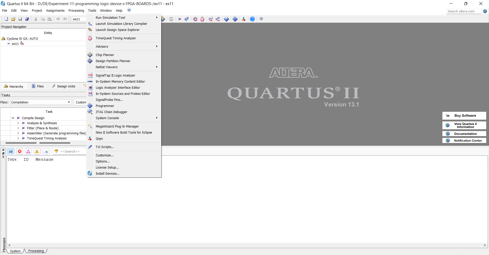
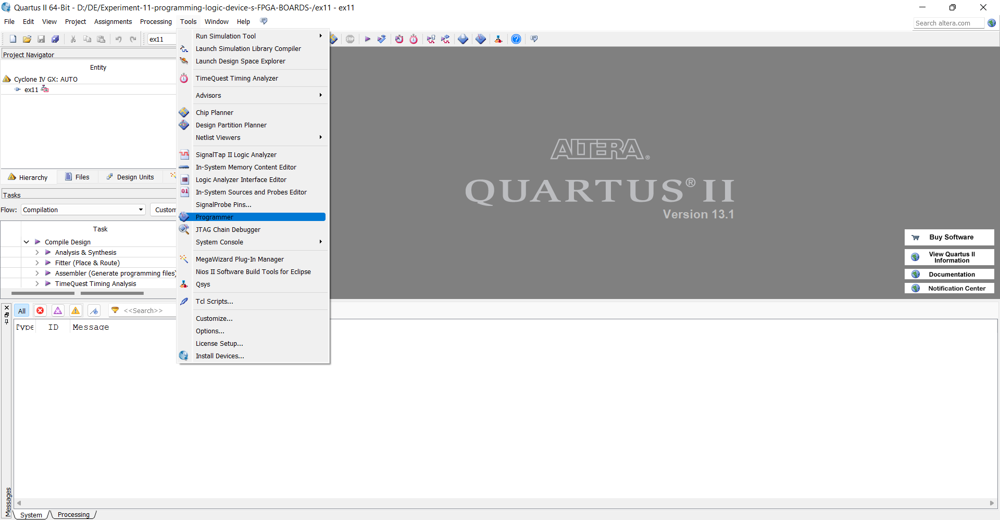
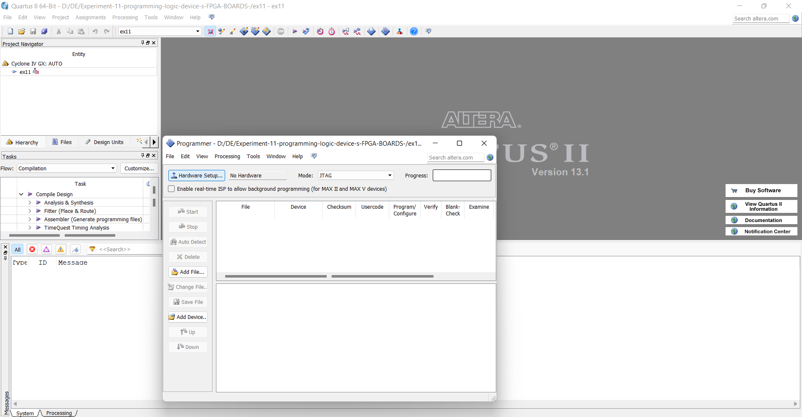
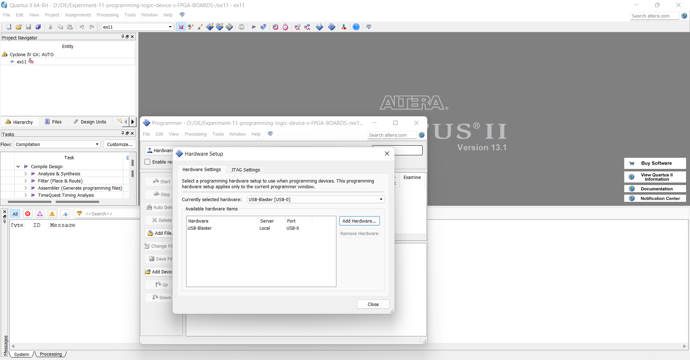
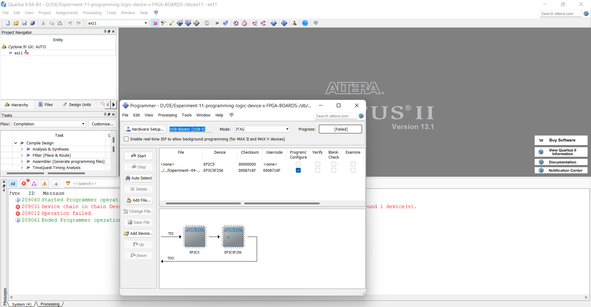
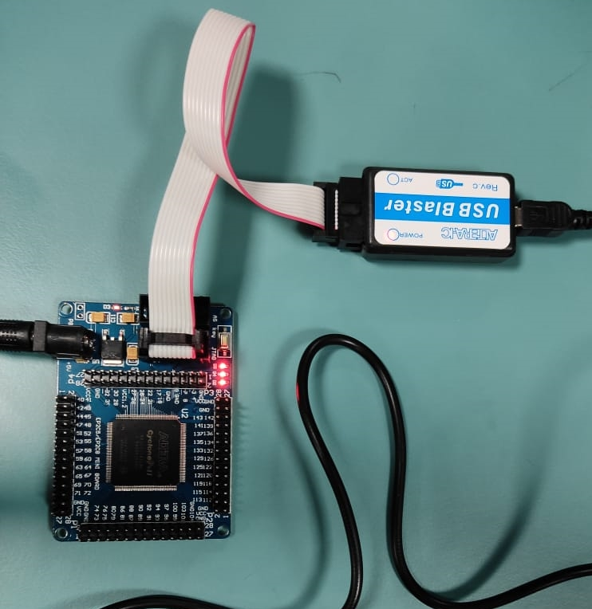

# Experiment-11-programming-logic-device-s-FPGA-BOARDS-
 ### AIM: 
 To understand the standard procedure to interface an FPGA board and flashing method using usb blaster 
### HARDWARE REQUIRED:  – 
PC, Cyclone II , USB flasher
### SOFTWARE REQUIRED:   
Quartus prime
### THEORY 

### Procedure 
```
1.Start the Quartus II Programmer.

2.Click Add File and select the path to the desired .sof.

3.Turn on the Program/Configure option for the added file.

4.Click Start to download the selected file to the FPGA. Configuration is complete when the progress bar reaches 100%.
```
#### Starting the Quartus II Programmer

#### Selecting the path 

#### Turning on the Program/Configure option

#### Downloading Process




### Output

### RESULTS 
The standard procedure to interface an FPGA board and flashing method using usb blaster is studied with the help of Quartus II Programmer.